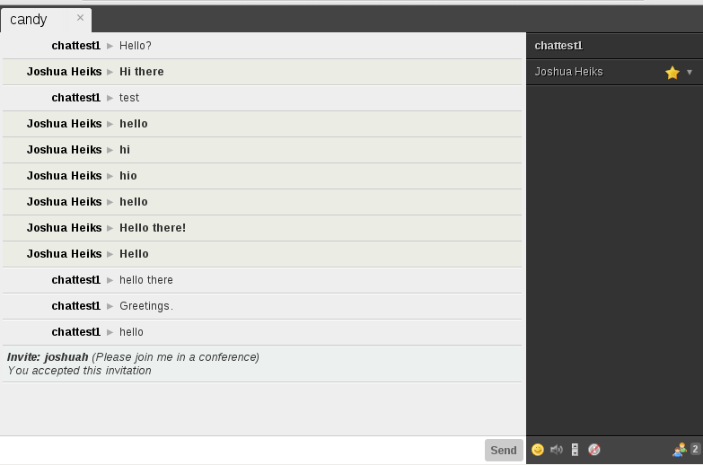

# RoleColors
Change the style of user messages based on their XMPP role and affiliation.

## Import

    
    <link rel="stylesheet" type="text/css" href="candyland/role-colors/candy.css" />

## Bootstrap

    CandyShop.RoleColors.init();

## CSS

You can customize the look and feel of the users message based on their **role** and **affiliation**.

    .rolecolors-role-visitor {}
    .rolecolors-role-participant {}
    .rolecolors-role-none {}
    .rolecolors-role-moderator {}
    .rolecolors-affiliation-owner {}
    .rolecolors-affiliation-admin {}
    .rolecolors-affiliation-member {}
    .rolecolors-affiliation-outcast {}
    .rolecolors-affiliation-none {}

## Screen Shots

