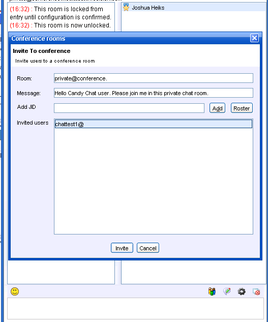
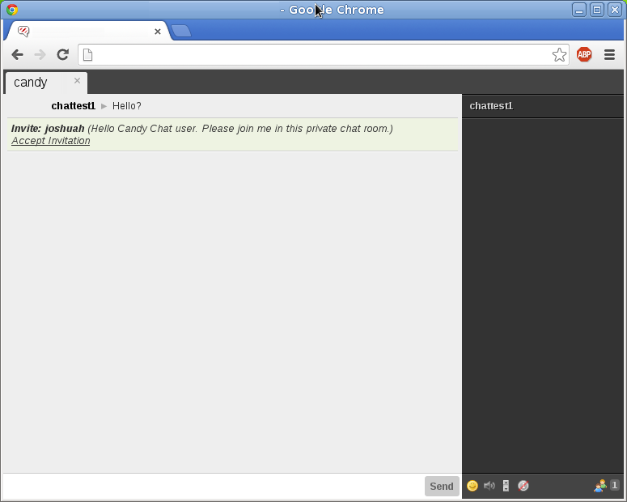
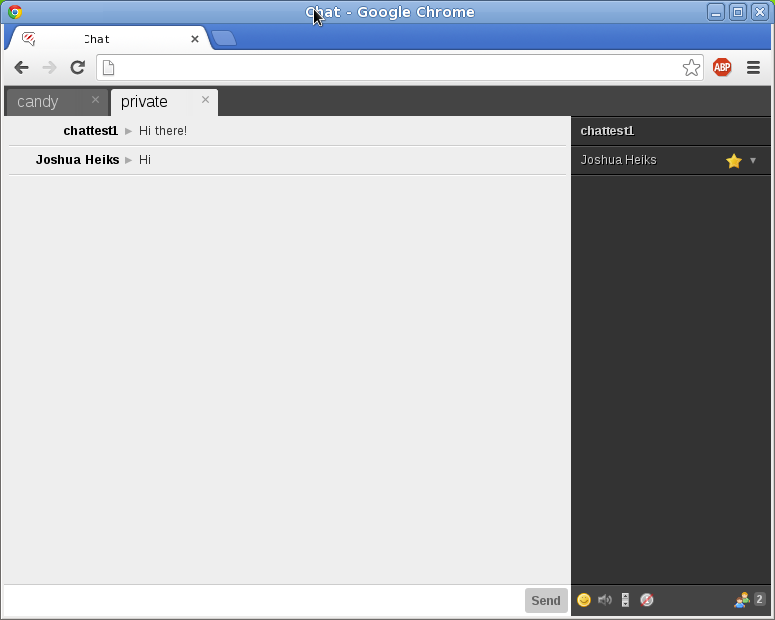

# SparkRoomInvites
Allows Candy users the ability to receive group chat invites from Spark. 

> Note: As of 2014-03-06 this requires the development branch of Candy. A new event named `candy:core:chat:message:other` was added in pull request [#236](https://github.com/candy-chat/candy/pull/236) which this plugin depends on.

## Import

    
    <link rel="stylesheet" type="text/css" href="candyland/spark-room-invites/candy.css" />

## Bootstrap

    CandyShop.SparkRoomInvites.init({
      /* When true the plugin will automatically join the user to
       * the chat room including filling in the password. When false
       * the user will be prompted inside all of their chat rooms.
       */
      autoJoin: false,
      // Number of ms to consider the invitation expired. Defaults to 10 minutes
      expireMs: 600000,
      // Number of ms between checking for expired invites.
      reapInterval: 5000
    });

## Screen Shots

## Screenshot

**Spark user invites a user from their current room.**

**Candy Chat user gets the invite and clicks on accept.**

**Candy Chat users is now joined to the room. The user did not have to type the password.**
